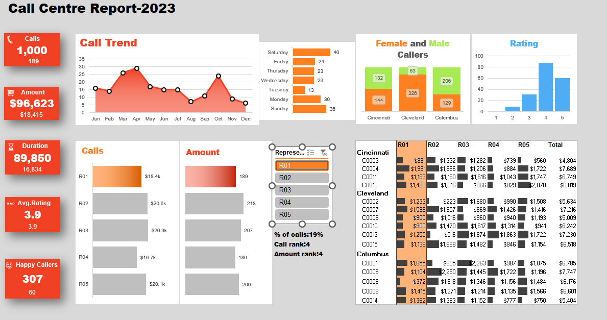

📊 Call Centre Report Dashboard – 2023

This repository contains an Excel-based Call Centre Report Dashboard for the year 2023. It provides a clean, data-driven summary of key performance indicators (KPIs) for call center operations. This tool is designed for performance tracking, reporting, and decision-making.
🧾 Features

    📈 Visual Dashboards with charts and pivot tables

    👥 Agent-wise Call Handling Data

    ⏱️ Average Handling Time (AHT), Resolution Rates

    📞 Monthly and Daily Call Volumes

    ✅ Performance Tracking and Target Monitoring

📂 File Included

    Call centre report-2023.xlsx – The main Excel file containing:

        Raw data sheets

        Pre-built pivot tables

        Interactive dashboard views

🔧 Requirements

To use the dashboard effectively:

    Microsoft Excel 2016 or later

    Macros not required (fully formula and pivot-based)

📌 Use Cases

    Call center performance review

    Management reporting

    Agent performance evaluation

    Operational efficiency analysis

📍Preview

  
  
    
  📃 License

This project is open for educational and organizational use. Modify and reuse as needed. Attribution appreciated.
